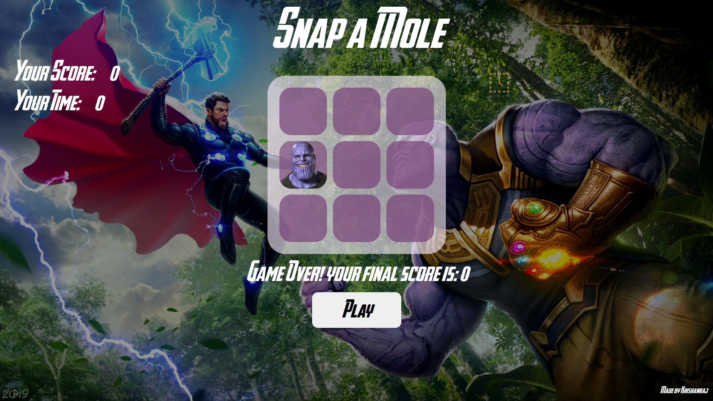
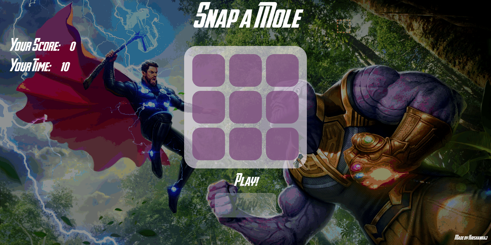

# Game-of-Memories
A simple Wack a Mole game in avengers theme written in HTML, CSS and JavaScript.

# Playing or Installation
1. Clone the Repository
2. Open the `index.html` file in your browser
3. Play the Game
4. Or just head over to [Its deployed Website!](http://snap-a-mole.surge.sh)

# Screenshot

# GamePlay

# Credits
As Always, thanks to tutorials from [The Free Code Camp.org](https://www.youtube.com/@freecodecamp) for their neverending help.
[This](https://www.youtube.com/watch?v=ec8vSKJuZTk&list=PLVzJm6SiAms8ghmF98T7bCiM7oAfA3uTW&index=13&t=5442s) video was referred to make this webpage. 

Music: https://www.chosic.com/free-music/all/

